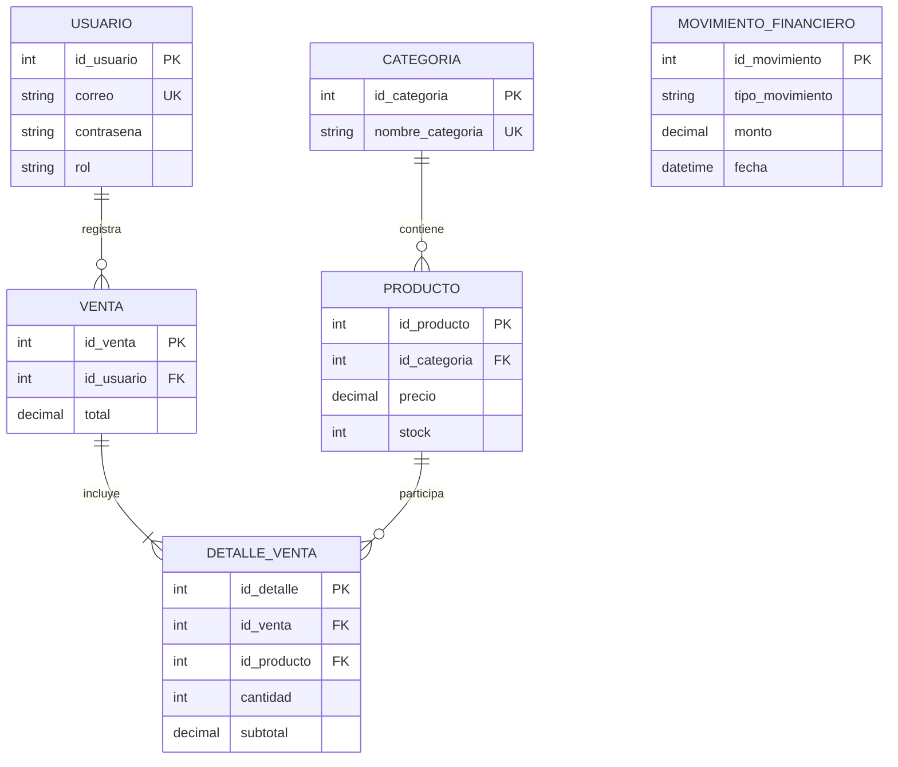

# Naye Fashion Store

Aplicación móvil Flutter con una API REST en Node.js, TypeScript y Express, respaldada por PostgreSQL y Prisma ORM.

## Estructura

- `backend/`: API, Prisma, migraciones y seed.
- `naye_fashion_store/`: aplicación Flutter para Android.
- `postman_collection.json`: solicitudes básicas para demostrar la API.

## Modelo de datos



El modelo mantiene exactamente seis entidades y cuatro claves foráneas. `DetalleVenta` resuelve la relación lógica muchos a muchos entre ventas y productos. Los valores monetarios usan `NUMERIC(10,2)`. Las restricciones de integridad incluyen precios, stock, cantidades, subtotales, montos y tipo de movimiento.

### Normalización

- **1FN:** cada campo contiene un valor atómico y no existen grupos repetidos.
- **2FN:** cada atributo depende de la clave primaria completa de su entidad.
- **3FN:** no se mantienen dependencias transitivas; categorías, usuarios y movimientos están separados de productos y ventas.

## Backend

Requisitos: Node.js 24 LTS, PostgreSQL 17 y Flutter 3.41.7 para la aplicación móvil.

```powershell
cd backend
copy .env.example .env
npm.cmd install
npx.cmd prisma validate
npx.cmd prisma migrate dev
npx.cmd prisma generate
npx.cmd prisma db seed
npm.cmd run build
npm.cmd start
```

El archivo `.env` debe contener `DATABASE_URL`, `JWT_SECRETO` y `PUERTO`. No se versionan credenciales reales.

Endpoints principales:

- `GET /api/salud`
- `POST /api/autenticacion/iniciar-sesion`
- `GET /api/categorias`
- `GET|POST /api/productos`
- `GET|PATCH|DELETE /api/productos/:id`
- `GET|POST /api/ventas`
- `GET|POST /api/movimientos-financieros`
- `GET /api/reportes/resumen`
- `POST /api/reportes/generar`
- `GET /api/documentacion`

Excepto salud y login, las rutas requieren `Authorization: Bearer <token>`.

## Flutter

```powershell
cd naye_fashion_store
flutter pub get
flutter analyze
flutter run --dart-define=URL_API=http://10.0.2.2:3000 --dart-define=TOKEN_JWT=token_temporal
```

`TOKEN_JWT` se inyecta únicamente para demostrar la comunicación protegida durante el desarrollo local. No es un mecanismo de autenticación de producción ni reemplaza un login móvil.

## Prisma y TypeORM

Prisma ofrece un cliente generado tipado, relaciones declarativas, migraciones integradas y una integración directa con TypeScript y PostgreSQL. TypeORM también modela relaciones y migraciones, pero suele requerir más configuración de entidades y decoradores. Para este proyecto Prisma resulta más simple de integrar y documentar; ambos pueden lograr un rendimiento comparable cuando las consultas e índices son adecuados.

## Optimización

El listado de productos usa cache-aside en memoria con TTL de 60 segundos e invalida la caché después de cambios. `backend/src/utilidades/demostracionN1.ts` compara consultas repetidas contra eager loading con `include`. La generación de reportes se delega a un `worker_threads` sencillo.


## Reproducibilidad

1. Clonar el repositorio.
2. Instalar PostgreSQL 17 y crear `naye_fashion_store`.
3. Configurar `backend/.env` a partir de `.env.example`.
4. Ejecutar la instalación, migración, generación, seed y build indicados arriba.
5. Iniciar el backend y probar `GET /api/salud` o importar la colección de Postman.
6. Obtener un JWT con el login y usarlo para ejecutar las rutas protegidas.

